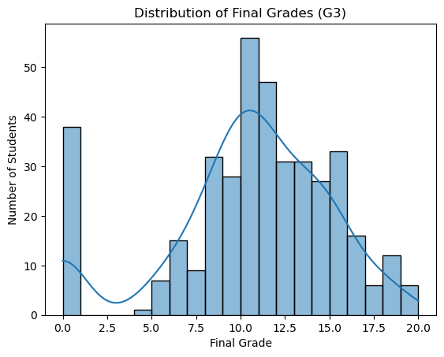
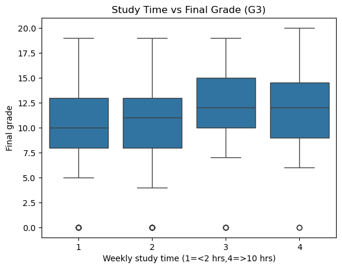
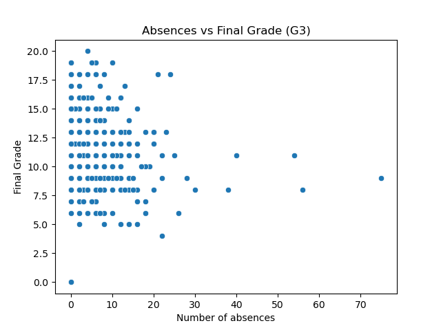
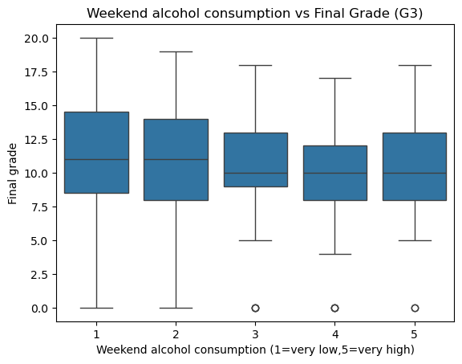

# Student Performance Analyzer 📊

A data analysis project using Python to explore academic and lifestyle factors influencing student performance.

---

## Objective
This project analyzes student performance to identify factors affecting final grades (G3).  
It explores the relationship between grades and features such as study time, absences, and lifestyle factors like alcohol consumption.

---

## Dataset
- **Source:** [UCI Machine Learning Repository – Student Performance Dataset](https://archive.ics.uci.edu/ml/datasets/Student+Performance)  
- The dataset contains student grades (G1, G2, G3) and 30 additional attributes related to:
  - Study habits
  - Absences
  - Alcohol consumption
  - Family and social background  
- Files used in this project:
  - `student_data_raw.csv` – original dataset
  - `student_data_clean.csv` – cleaned dataset
  - `student-data-info.txt` – description of attributes

---

## Tools Used
- Python 3.9+
- Pandas, NumPy
- Matplotlib, Seaborn
- Jupyter Notebook / VS Code

---

## Project Structure
student-performance-analyzer/
├── data/
│   ├── info about data.txt
│   ├── student_data_clean.csv
│   └── student-data-info.txt
├── notebooks/
│   └── student_analysis.ipynb
├── images/
│   ├── g3_distribution.png
│   ├── studytime_vs_g3.png
│   ├── absences_vs_g3.png
│   ├── walc_vs_g3.png
│   └── correlation_heatmap.png
├── README.md
└── requirements.txt

---

## Exploratory Data Analysis (EDA)

### 1. Distribution of Final Grades (G3)


**Insight:**  
Most students scored in the mid-range. Extremely high or very low final grades are relatively uncommon.

---

### 2. Study Time vs Final Grade


**Insight:**  
Students who spend more time studying per week generally tend to achieve higher final grades.

---

### 3. Absences vs Final Grade


**Insight:**  
An increase in absences is associated with slightly lower final grades.

---

### 4. Weekend Alcohol Consumption vs Final Grade


**Insight:**  
Higher weekend alcohol consumption shows a mild negative relationship with academic performance.

---

### 5. Correlation Heatmap


**Insight:**  
- G1 and G2 have the strongest positive correlation with G3  
- Study time has a small positive correlation with final grades  
- Absences show a negative correlation with performance  
- Most other numeric features show weak correlations  

---

## How to Run

1. Clone the repository:  
```bash
git clone https://github.com/shradhapatil702-droid/student-performance-analyzer.git
```

2. Navigate to the project folder:
```bash
cd student-performance-analyzer
```

3. Install dependencies:
```bash
pip install -r requirements.txt
```

4. Open the notebook and run step by step:

Open notebooks/student_analysis.ipynb in Jupyter Notebook or VS Code

Run all cells sequentially

***Future Improvements***

- Build predictive models (Linear Regression / Machine Learning)

- Compare Math and Portuguese course datasets

- Create interactive dashboards using Plotly or Power BI

***Author: Shraddha Patil***
***GitHub: https://github.com/shradhapatil702-droid***
